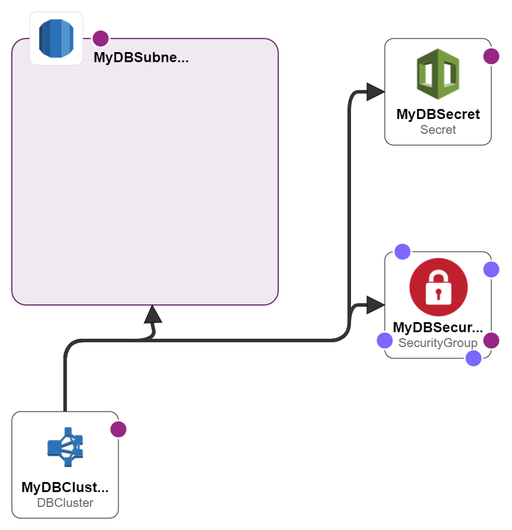
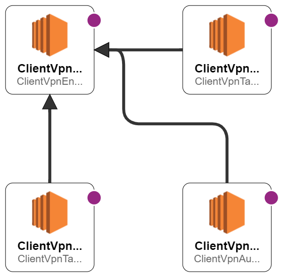
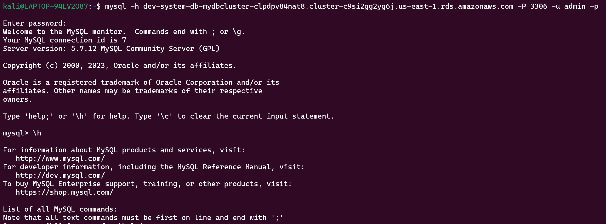

# AWS-CLIENT-VPN-VPC-PEERING-RDS-CloudFormation

This project is a solution for a challenge to demonstrate advanced AWS infrastructure provisioning using CloudFormation. The goal is to create a multi-VPC architecture with an RDS Aurora MySQL Serverless database with client VPN connectivity. This project shows how to provision a development and a shared system network, establish VPC peering between them, deploy an RDS database in the development system, and set up a VPN client in the shared system and finally able to connect the RDS database from the client machine through the VPN. This project enables secure and scalable access to cloud resources across different VPCs.

## Project Components

- `shared-system.yaml`: Template for creating the shared system VPC with public and private subnets.
- `dev-system.yaml`: Template for creating the development system VPC with public and private subnets.
- `vpc-peering.yaml`: Template for establishing VPC peering between the shared and development system networks.
- `rds-aurora-db-cluster.yaml`: Template for deploying an RDS Aurora MySQL Serverless database in the development system network.
- `aws-client-vpn.yaml`: Template for deploying aws vpn client along with necessary authorizers and associations.




## Progress

- [x] **VPC Setup**: Successfully created VPCs for both shared and development systems, each with isolated subnets.
- [x] **VPC Peering**: Established a peering connection between the VPCs, facilitating secure inter-VPC communication.
- [x] **RDS Deployment**: Succesfully deployed Aurora Serverless MySQL RDS database within the development VPC, and also integrated AWS secrets manager for passwords.
- [x] **AWS VPN Client setup**: in the shared system network.
- [x] **RDS Connectivity** testing and finalization.

## Deployment Instructions

1. Update each template with your specific AWS environment details.
2. Deploy the templates in order: shared-system, dev-system, vpc-peering, then rds-aurora-db-cluster in aws console.
3. Generate client and server certificates for VPN setup. [AWS documentation](https://docs.aws.amazon.com/vpn/latest/clientvpn-admin/mutual.html) provides guidelines on this process.
4. After generating client and server certificates import them using aws cli, which will give you the acm server certificate arn.
5. Now deploy the aws-client-vpn.yaml cloudformation template, with the server certificate arn as the input parameter.
6. Wait till the vpn client becomes active and add the final routes of dev-shared cidr in the vpn endpoint.
7. Download and install the aws client vpn based on your os and test the connectivity. [AWS client vpn download page](https://aws.amazon.com/vpn/client-vpn-download/).

## Testing Connectivity

```mysql -h dev-system-db-mydbcluster-clpdpv84nat8.cluster-c9si2gg2yg6j.us-east-1.rds.amazonaws.com -P 3306 -u admin -p```

* Replace the rds host and username with your values, enter password and you should be able to connect.



## Final Demo(Watch the below video):
[](https://youtu.be/kkISL88uSTw)

